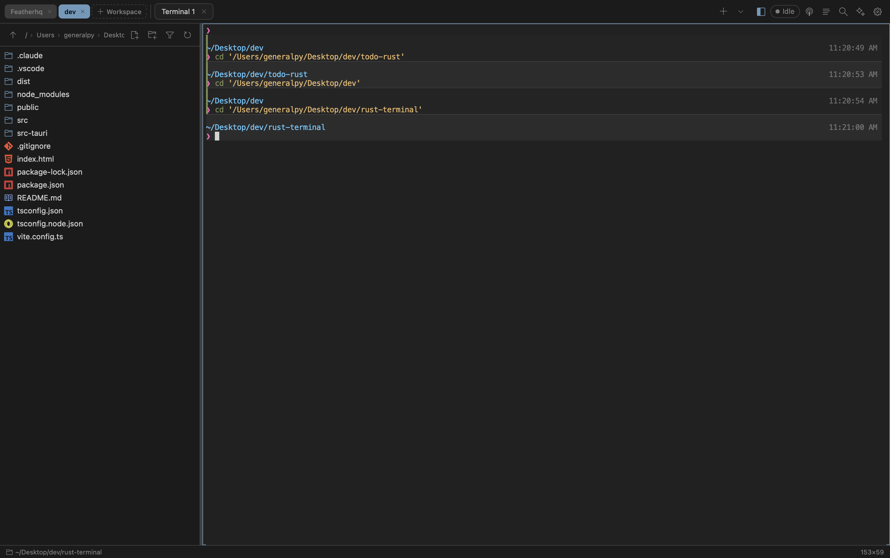
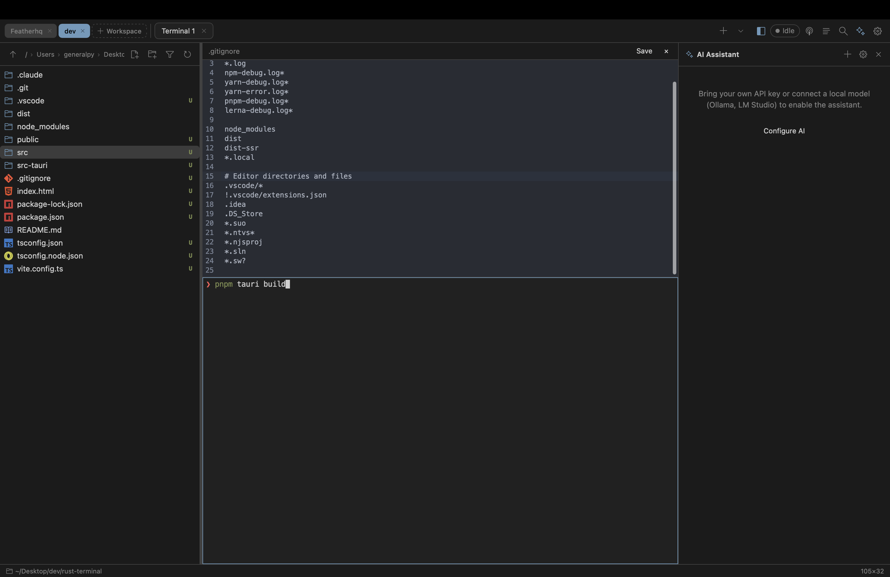
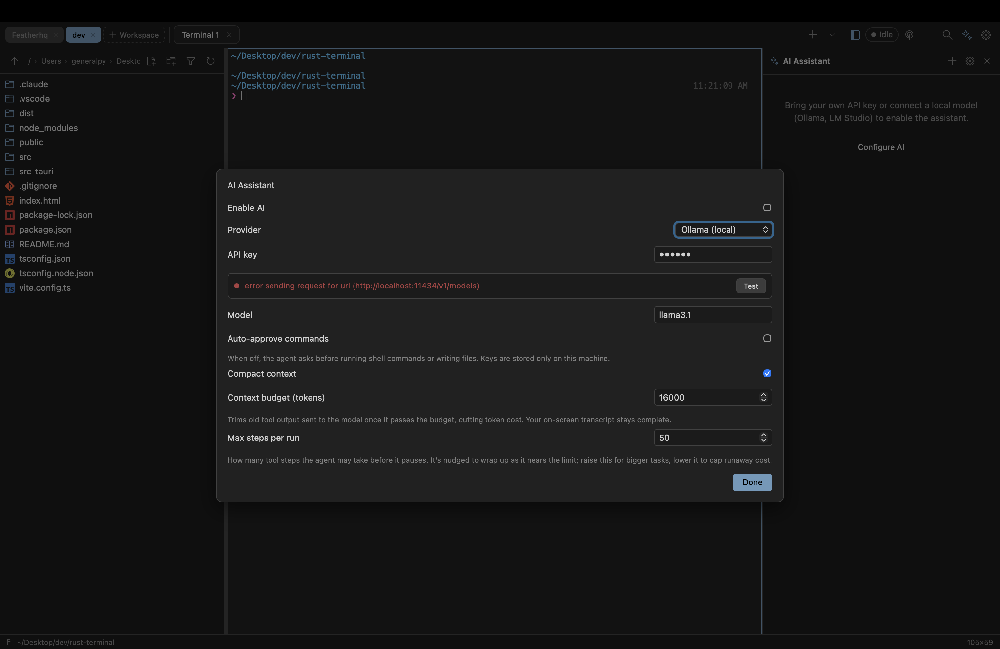
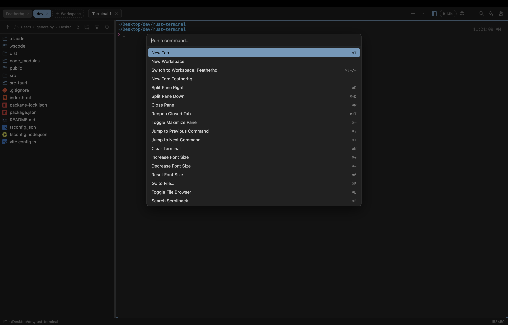
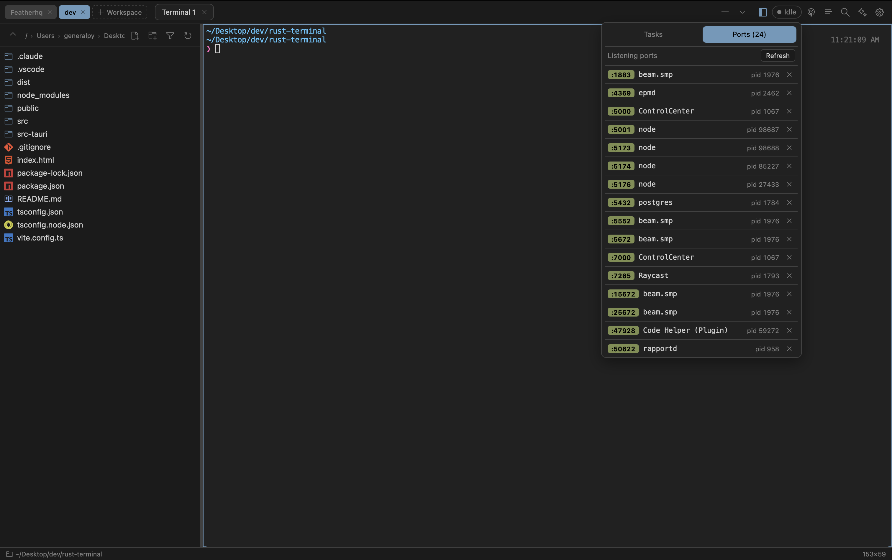
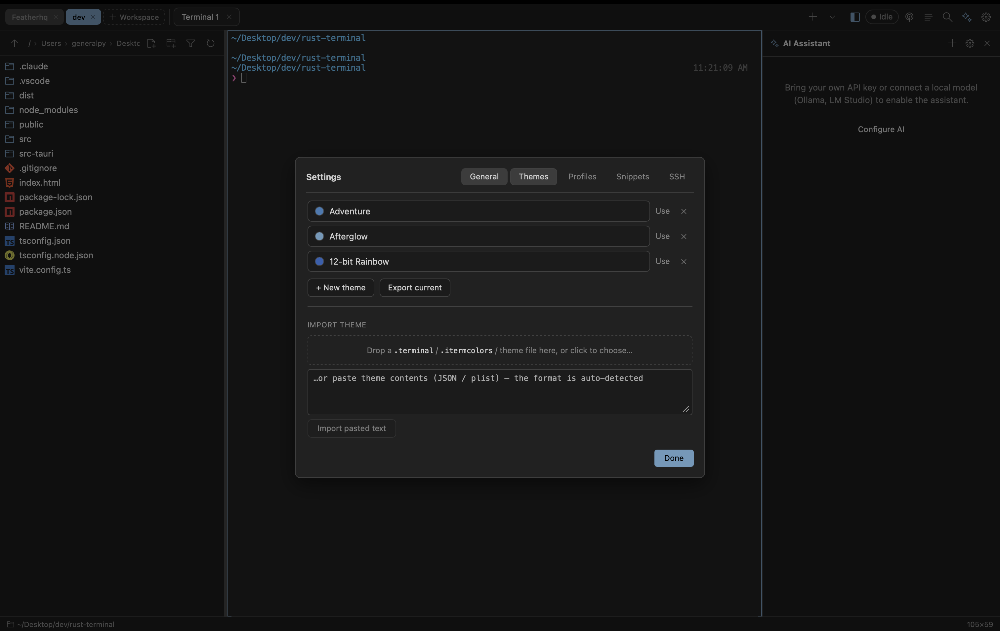
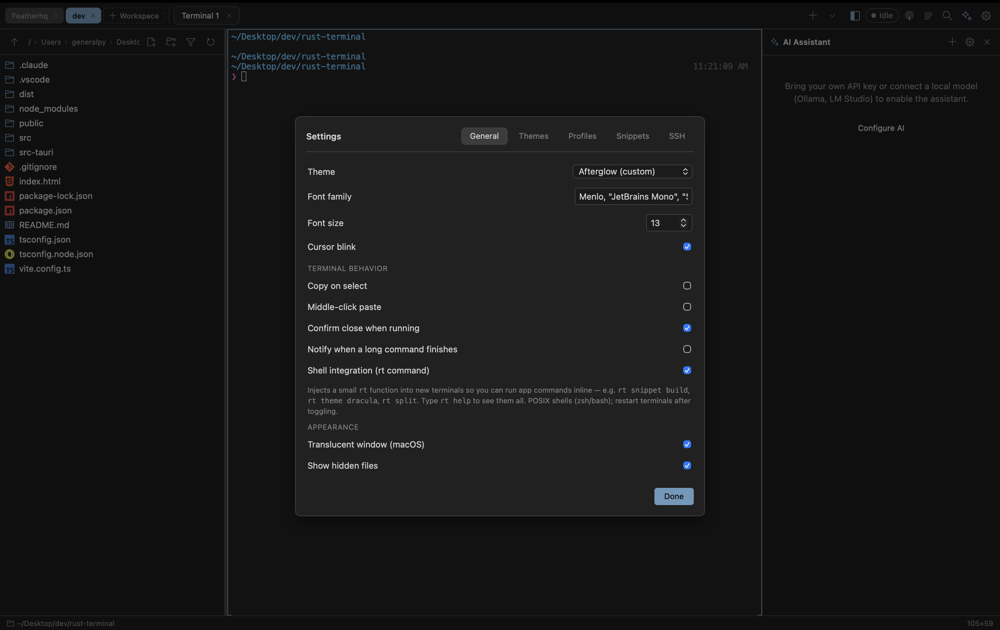

<div align="center">

# 🪄 Rune

**A fast, modern, GPU-accelerated terminal — built with Rust, Tauri & React.**

Rune is a cross-platform terminal emulator with a built-in file browser, code editor,
AI assistant, and activity monitor. It's a personal project exploring what a terminal
can be when the shell, the editor, and an agent all live in one window.

[](https://github.com/generalpy101/rune/actions/workflows/ci.yml)




</div>

---

## ✨ Features

- **GPU-accelerated rendering** — [xterm.js](https://xtermjs.org/) with the WebGL renderer for smooth, fast output.
- **Tabs, workspaces & split panes** — split any pane left/right or top/bottom, maximize a pane, and group tabs into workspaces.
- **Native PTY backend** — pseudo-terminals run in Rust via [`portable-pty`](https://crates.io/crates/portable-pty), so full-screen programs (vim, htop, less) behave correctly.
- **Integrated file browser** — live **git status** badges, fuzzy quick-open, reveal-in-Finder, and full file operations (create, rename, move, copy, duplicate, delete).
- **Built-in code editor** — [CodeMirror 6](https://codemirror.net/) with syntax highlighting for Rust, JS/TS, Python, Go, Java, C/C++, PHP, HTML, CSS, JSON, SQL, XML, YAML, Markdown and more.
- **AI assistant** — bring your own API key or connect a **local model** (Ollama / LM Studio). An optional agent can run shell commands with an approval gate, a token budget, and a step cap to keep it on a leash.
- **Activity monitor** — see running tasks and **listening ports** at a glance, and kill a process straight from the panel.
- **Themes** — ship-with themes plus import from `.terminal` / `.itermcolors` files, create your own, and export the current theme.
- **Snippets & SSH hosts** — save reusable commands and SSH targets, launch them from the command palette or the `rt` shell helper.
- **Command palette** — every app action a keystroke away (`⌘P` to jump to a file, `⌘K` to clear, and more).
- **Shell integration** — a tiny `rt` helper lets you drive the app *from inside* the shell (`rt split`, `rt theme`, `rt ssh prod` …).
- **Auto-updates** — signed releases delivered via the Tauri updater.

---

## 📸 Screenshots

| Integrated editor + terminal + AI | AI assistant |
| :---: | :---: |
| [](screenshots/integrated-editor.png) | [](screenshots/ai-assistant.png) |
| Edit files side-by-side with a live terminal pane | Bring your own key or run a local model |

| Command palette | Activity monitor |
| :---: | :---: |
| [](screenshots/command-palette.png) | [](screenshots/activity-monitor.png) |
| Run any app action without leaving the keyboard | Inspect tasks & listening ports, kill processes |

| Theme manager | Settings |
| :---: | :---: |
| [](screenshots/theme-manager.png) | [](screenshots/settings.png) |
| Import `.terminal` / `.itermcolors` or roll your own | Fonts, behavior, shell integration & appearance |

---

## 🧱 Tech stack

| Layer | Technology |
| --- | --- |
| Shell / native | **Rust** + **[Tauri 2](https://tauri.app/)** (`portable-pty`, `reqwest`, `tokio`) |
| UI | **React 19** + **TypeScript**, bundled with **[Vite 7](https://vite.dev/)** |
| Terminal | **[xterm.js](https://xtermjs.org/)** (WebGL, fit, search, web-links addons) |
| Editor | **[CodeMirror 6](https://codemirror.net/)** |

---

## 🚀 Getting started

### Prerequisites

- [**Rust**](https://www.rust-lang.org/tools/install) (stable toolchain)
- [**Node.js**](https://nodejs.org/) 20.19+ or 22.12+ and npm
- Platform build dependencies for Tauri — see the
  [Tauri prerequisites guide](https://tauri.app/start/prerequisites/)
  (Xcode CLT on macOS; `webkit2gtk-4.1` & friends on Linux; WebView2 on Windows).

### Develop

```bash
git clone https://github.com/generalpy101/rune.git
cd rune
npm install
npm run tauri dev
```

### Build a release bundle

```bash
npm run tauri build
```

The packaged app (`.app` / `.dmg`, `.deb` / `.AppImage`, `.msi` / `.exe`) is written to
`src-tauri/target/release/bundle/`.

---

## ⌨️ Handy shortcuts

Open the command palette to discover every action and its shortcut. Some of the most-used:

| Shortcut | Action |
| --- | --- |
| `⌘T` | New tab |
| `⌘D` / `⌘⇧D` | Split pane right / down |
| `⌘W` | Close pane |
| `⌘⇧T` | Reopen closed tab |
| `⌘P` | Go to file… |
| `⌘B` | Toggle file browser |
| `⌘F` | Search scrollback |
| `⌘K` | Clear terminal |
| `⌘+` / `⌘-` / `⌘0` | Increase / decrease / reset font size |

> Shortcuts shown for macOS; use `Ctrl` in place of `⌘` on Linux/Windows.

---

## 🐚 Shell integration (`rt`)

With shell integration enabled (Settings → General), Rune injects a small `rt` shell
function that talks to the app from inside your shell. It works in zsh, bash and sh.

```text
rt snippet <name>       run a saved snippet
rt snippets             list saved snippets
rt ssh <name>           connect to a saved SSH host
rt hosts                list saved SSH hosts
rt theme [name]         switch theme (no name = list)
rt split [right|down]   split the focused pane
rt close                close the focused pane
rt tab                  open a new tab
rt sidebar              toggle the file browser
rt ai                   toggle the AI assistant
rt clear                clear this terminal
rt help                 show this help
```

Under the hood `rt` emits a custom OSC escape sequence that xterm intercepts and routes
to the app, so it never interferes with full-screen TUI programs.

---

## 🗂️ Project structure

```text
rune/
├── src/                    # React + TypeScript front-end
│   ├── components/         # Terminal, file browser, editor, AI panel, settings…
│   ├── lib/                # PTY bridge, fs, themes, snippets, shell-integration (rt)
│   └── ai/                 # AI agent, providers, context & history management
├── src-tauri/              # Rust / Tauri back-end
│   ├── src/
│   │   ├── pty.rs          # pseudo-terminal management
│   │   ├── fs.rs           # filesystem & git commands
│   │   ├── ai.rs           # streaming AI chat + agent command runner
│   │   ├── sysmon.rs       # listening ports & process control
│   │   ├── platform.rs     # cross-platform shell / process helpers
│   │   └── update.rs       # auto-updater
│   └── tauri.conf.json
└── screenshots/
```

---

## 🤝 Contributing

This is a personal project, but issues and pull requests are welcome. Every PR is checked
by [CI](.github/workflows/ci.yml): the front-end is type-checked and built, and the Rust
back-end is compiled on macOS, Linux and Windows.

```bash
# before opening a PR
npm run build                                   # type-check + bundle the UI
cargo build --manifest-path src-tauri/Cargo.toml
```

---

<div align="center">
Made with 🦀 and ⚛️ by <a href="https://github.com/generalpy101">@generalpy101</a>
</div>
